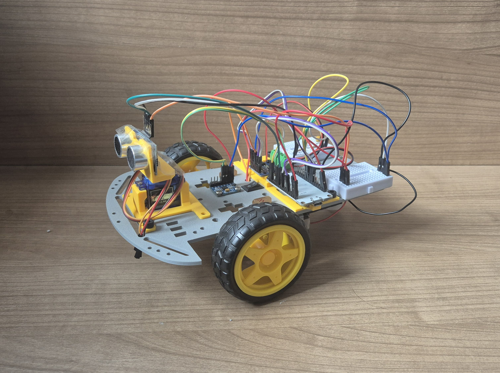

# ESP32 2WD Robot Car

This repository documents my work for the "CT7159: Sensors, Actuators and Control" module at London Metropolitan University. The project spans three major workshops over three months, involving the construction and programming of a 2WD robot car from the ground up.

The project demonstrates a comprehensive understanding of embedded systems, from basic hardware assembly and actuator control to advanced sensor integration, data filtering, and PID control loops.

📄 [**View the Full Project Logbook (PDF)**](./2WD_Mobile_Robot_Car_Logbook.pdf) for detailed documentation of each task, including methodologies, challenges, and results.



---

## 🛠️ Key Features & Concepts Explored

This project is divided into three main workshops, each building upon the last:

#### **Workshop 3: Actuators**
* **Hardware Assembly:** Construction of the 2WD chassis with custom 3D-printed mounts for the ESP32 and motor driver.
* **Motor Control:** Driving DC motors using an L9110 H-Bridge driver.
* **Speed Control:** Implementing Pulse Width Modulation (PWM) for variable motor speed.
* **Servo Implementation:** Controlling a servo motor for precise angular positioning and sweeping motions.
* **Obstacle Avoidance:** Integrating an HC-SR04 ultrasonic sensor for distance measurement and implementing an autonomous obstacle avoidance routine.

#### **Workshop 4: Sensors**
* **Custom Libraries:** Designing and implementing a custom C++ library in the Arduino IDE.
* **Analog & Digital Filtering:** Applying Moving Average and Cumulative Average filters to noisy sensor data (MPU-6050 and BMP280).
* **Environmental Sensing:** Interfacing with a BMP280 sensor to read temperature and pressure.
* **Motion Sensing:** Integrating an MPU-6050 accelerometer/gyroscope to measure pitch and roll.
* **Kinetic Control:** Manipulating the robot's motor speed based on the tilt angle detected by the MPU-6050.

#### **Workshop 5: PID Control**
* **Analog Circuits:** Building a physical RC filter circuit to demonstrate control theory concepts.
* **PID Implementation:** Programming and tuning a PID (Proportional-Integral-Derivative) controller to stabilize the output of the RC circuit.
* **Self-Balancing Logic:** Applying the PID controller to the robot car, using the MPU-6050's angle data as feedback to maintain balance.

---

## 🚀 Core Competencies

* **Embedded Systems Programming:** C++ development in the Arduino IDE for the ESP32 microcontroller.
* **Sensor Integration & Interfacing:** I2C (MPU-6050, BMP280), PWM, and Digital I/O (HC-SR04).
* **Actuator Control:** Precise control of DC motors (with H-Bridge) and servo motors using PWM.
* **Control Systems Theory:** Practical implementation and tuning of PID controllers for system stabilization.
* **Data Filtering:** Designing and applying digital filters (Moving Average, Exponential) to reduce sensor noise.
* **IoT & Web Servers:** Creating and hosting a web-based control interface on an ESP32 hotspot.
* **Hardware & Prototyping:** Circuit design (RC filter), component assembly, and 3D printing for custom mounts.

---

## ⚙️ Hardware & Software

* **Microcontroller:** ESP32
* **Chassis:** 2WD Robot Car Kit
* **Actuators:**
    * 2x DC Motors
    * L9110 H-Bridge Motor Driver
    * SG90 Servo Motor
* **Sensors:**
    * HC-SR04 Ultrasonic Sensor
    * BMP280 (Temperature & Pressure Sensor)
    * MPU-6050 (Accelerometer & Gyroscope)
* **Software:** Arduino IDE
* **Key Libraries:** `Adafruit_BMP280`, `Adafruit_MPU6050`

---

## 📁 Repository Structure

The code for this project is organized into folders corresponding to each workshop. Within each workshop folder, individual tasks are further separated into their own sub-folders, containing the relevant `.ino` file.

```
.
├── Workshop_3_Actuators/     # Code for motor, servo, and ultrasonic control
├── Workshop_4_Sensors/       # Code for BMP280, MPU-6050, and custom libraries
└── Workshop_5_PID/           # Code for PID controller implementation
